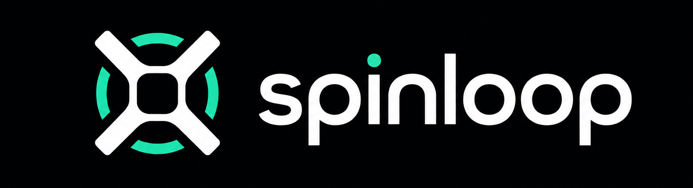
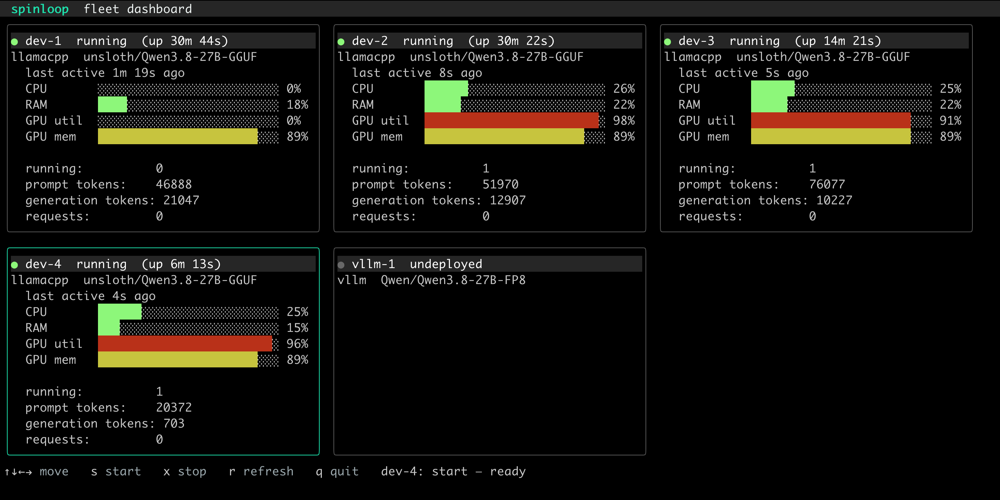

<p align="center">
  
</p>

<p align="center">
  Spin up your agent loop. One CLI to run a fleet of LLMs on local machine / LAN / Tailscale or in AWS.
</p>
<p align="center">
  <code>spinloop</code> is a CLI for deploying models, observing them, fetching metrics and connecting them to your coding agent/harness. A static, zero-dependencies binary you can run anywhere.
</p>

<p align="center">
  <em>llama.cpp, vLLM, MTPLX or oMLX &middot; deploy local, LAN or cloud &middot; connect opencode, Pi, Lucinate, OpenClaw, Hermes etc.</em>
</p>

---

```sh
brew install spinloop-ai/tap/spinloop
```

`spinloop` runs a model where it suits you — on this machine, on any machine on
your network, or on a cloud GPU that exists only while you are using it — and
then points your coding agent at whichever one is serving it. A `Spinloop`
file describes the model once, and every step below works from that one
description.

## Serve a model, then point your agent at it

### 1. On this machine

A `Spinloop` says what to run. It travels with the project, like a Dockerfile:

```dockerfile
# Spinloop
PROVIDER llamacpp
MODEL    unsloth/Qwen3.6-35B-A3B-GGUF:UD-Q4_K_XL   # HF repo, or a .gguf path
CONTEXT  32768
```

```sh
spinloop serve              # runs llama-server with that model
```

llama.cpp, vLLM, MTPLX and oMLX all run from those same few lines — change
`PROVIDER` and the same file serves the model on a different engine.
→ [Serving a local model](#serving-a-local-model)

### 2. On every machine you own

Whilst `serve` holds a terminal open for as long as the model runs, `spinloop daemon`
doesn't: leave it on a machine and that machine will serve a model whenever you
want one — starting when you ask, and still up for your next session.

```sh
# on each machine that will serve
spinloop daemon   # ready on :4242; no model runs until you ask

# on the machine you work at — fleet.yaml names the nodes
spinloop fleet status                  # one row per node: state, and what it serves
spinloop fleet dashboard               # the same fleet, as a board you leave open
```

Start the whole fleet with `spinloop up` or just one with `spinloop fleet start gpu-box` — this gets you the model from step 1 running on a machine across the room, or over Tailscale.

<p align="center">
  
</p>

In this screenshot, five nodes are configured and four are up, each serving the same
`Qwen3.8-27B` model through llama.cpp. Three of them — `dev-2`, `dev-3`,
`dev-4` — are mid-request: one slot running apiece, GPU util between 91% and
98%. `dev-1` finished about a minute ago, so its GPU util has dropped to 0%
while GPU memory stays at 89% — the weights are still loaded, and the next
request it takes starts generating without a reload.

The keys along the bottom drive the fleet from here: `s` start, `x` stop, `r`
refresh, and `<enter>` for one node full-screen with its engine log tailed live.
→ [The fleet](#the-fleet)

### 3. On a cloud GPU, for as long as you need one

Nothing on your desk with a big enough card? `spinloop remote` drives a
scale-to-zero instance in your own AWS account: it boots when you ask, loads the
model, and stops itself once you stop using it.

```sh
spinloop remote start     # boot, wait for the model to load, print the endpoint
spinloop remote keep 4h   # hold it against the idle sweep while you work
spinloop remote stop      # terminate now, rather than waiting for the idle timer
```

A remote is also just another node: give it `kind: remote` in `fleet.yaml` and it
sits on the same board as the machines you own. That is `vllm-1` in the picture
above — configured, no instance running, costing nothing until someone presses
`s`. → [Remote inference instance](#remote-inference-instance)

### Then point your agent at it

Wherever the model ended up, this part is the same, and it reads the same file:

```sh
spinloop apply       # point your agent at that model
spinloop harness     # launch the agent, now running it
```

opencode, Pi and lucinate are all supported, chosen when you launch rather than
written into the file. A `Spinloop` naming a `FLEET` routes the launch to a node
that already has the model — or can load it — so the machine you are sitting at
needs no addresses of its own.

Not serving it yourself? The same commands point an agent at a hosted model:
`spinloop add -p openrouter -m deepseek/deepseek-v4-flash`, then
`spinloop harness`.

## Supported providers

Every provider below is built in — name it with `-p` and `spinloop` fills in the
base URL, package and key variable for you. Run `spinloop list` to see them with
their models.

| Provider | `-p` name | What it is |
| --- | --- | --- |
| OpenRouter | `openrouter` | Hosted model aggregator — hundreds of models behind one key |
| AWS Bedrock | `amazon-bedrock` | Claude and other models, authenticated with your AWS credentials |
| Google Vertex AI (Gemini) | `google-vertex` | Gemini models on GCP, via your Google credentials |
| Google Vertex AI (Claude) | `google-vertex-anthropic` | Anthropic Claude on GCP, via your Google credentials |
| Ollama | `ollama` | Local Ollama server |
| llama.cpp | `llamacpp` | Local (or remote) llama-server |
| oMLX | `omlx` | Local oMLX server on Apple Silicon |
| vLLM | `vllm` | Local or self-hosted vLLM server |
| MTPLX | `mtplx` | Local MTPLX server on Apple Silicon |
| OpenAI-compatible | `openai-compatible` | Any endpoint that speaks the OpenAI API — set the base URL and key |

Need one that isn't listed? You can add it yourself — see
[Adding providers and models](#adding-providers-and-models).

---

Your coding agent is only as good as the model behind it, and the model you want
changes by the day — a frontier model on OpenRouter for the hard stuff, a local
Qwen on llama.cpp when you're offline or cost-conscious, Claude on Bedrock for
work. Switching between them should take a second. It usually doesn't.

Every agent keeps its config somewhere different, in a shape of its own. Pointing
one at a new provider means opening that file by hand and getting four things
exactly right: the base URL, the model id, the package it loads, and the name of
the environment variable holding your key. One stray brace and the agent won't
start. **Local models are the worst of it** — each runtime has its own ports,
model refs and quirks, and none of it is written down where you need it.

`spinloop` is the supply line for your coding agent. Tell it the provider you want and
it configures the agent for you:

- **One command, any model.** Pick from a built-in catalogue — OpenRouter,
  Bedrock, Ollama, llama.cpp, vLLM, oMLX, MTPLX, or any OpenAI-compatible
  endpoint. No
  URLs to look up, and `spinloop list --models` fetches the model ids straight from
  the provider.
- **Your config survives.** Settings are merged *into* what you already have.
  Other providers, your theme, even your comments stay exactly where you left them.
- **Keys stay where they belong.** Secrets are read from a local `.env` and never
  hard-coded somewhere they'll leak — written `0600`, or kept as an env reference.
- **Local models, sorted.** The same file that points your agent at a local model
  can launch the server for it. One source of truth, two jobs.

Works with [opencode](https://opencode.ai),
[Pi](https://github.com/earendil-works/pi) and
[lucinate](https://lucinate.ai) today — pick the one you use
per command, or set a default. The same selection works for any of them.

## Install

With [Homebrew](https://brew.sh):

```sh
brew install spinloop-ai/tap/spinloop
```

To upgrade later, run `brew upgrade spinloop`.

### From source

```sh
go build -o spinloop ./cmd/spinloop
```

Drop the resulting `spinloop` binary anywhere on your `PATH`.

## Quickstart

See what's in the catalogue:

```sh
spinloop list
```

Need a model id? Ask the provider itself — no memorising, no guessing:

```sh
spinloop list --models openrouter    # the models it currently serves, live
```

Add a provider and a model:

```sh
# OpenRouter needs a key — put it in .env first:
echo 'DEEPSEEK_API_KEY=sk-or-v1-...' > .env

spinloop add --provider openrouter --model deepseek/deepseek-v4-flash
```

Then just run `opencode`. That's it — your agent is pointed at the new model, and
the rest of your config is untouched.

### More examples

```sh
# A local Ollama model (no key required)
spinloop add -p ollama -m llama3.2

# Claude on AWS Bedrock (uses your AWS credentials)
spinloop add -p amazon-bedrock -m anthropic.claude-3-5-sonnet

# Any OpenAI-compatible endpoint, base URL via flag
OPENAI_API_KEY=sk-... \
  spinloop add -p openai-compatible -m my-model --base-url https://my-endpoint/v1

# Pin a specific default model
spinloop add -p openrouter -m deepseek/deepseek-v4-pro

# Set the context window — human suffixes or an absolute count, both fine
spinloop add -p llamacpp -m my-model -c 128k
spinloop add -p llamacpp -m my-model --context 200000

# Cap the max output tokens too (defaults to a quarter of the context)
spinloop add -p llamacpp -m my-model -c 128k -o 32k

# Take a provider back out
spinloop remove -p ollama

# Or just drop one model
spinloop remove -p openrouter -m deepseek/deepseek-v4-flash
```

On opencode, `add` sets the chosen model as the default and `remove` clears it
if it pointed at something you removed. Pi has no default-model setting, so
`add` just registers the provider and tells you which model to pick with `/model`.
On lucinate, `add` writes an OpenAI-compatible connection and points lucinate's
startup default at it, so it opens straight onto the model you chose.

`--context`/`-c` records each added model's context window. Parsing is
forgiving: `128k`, `1m`, `1.5m`, `200000`, `128,000`, even `128 K tokens` all
land where you'd expect (`k`/`m`/`g` are decimal — `128k` is 128,000 tokens).

`--output`/`-o` caps the max output tokens, in the same format. opencode needs
one whenever a context is set, so when you leave it off `spinloop` fills in a
quarter of the context for you. It can't exceed the context window.

## Usage

```sh
spinloop list   [--models [<provider>]]    # the catalogue; --models fetches live model ids
spinloop show   [--harness <name>]         # show what the harness has configured
spinloop add    --provider <name> [--model <id>] [--alias <name>] [--context <size>] [--output <size>] [--base-url <url>]
spinloop remove --provider <name> [--model <id>] [--alias <name>]
spinloop apply  [path] [--output <size>]   # apply a Spinloop file or directory (default ./Spinloop)
spinloop unapply [path]                    # remove what a Spinloop file selects
spinloop alias  [path] [-n <name>] [-l]    # name a Spinloop; -l lists them
spinloop unalias <name>                    # drop a registered name
spinloop serve  [path] [--dry-run] [-a]    # run the PROVIDER's inference server, from the PRESET
                                         #   (-a/--api serves the control API beside it)
spinloop daemon [--api-addr <addr>] [--loopback] # let this machine serve a model on request —
                                         #   runs nothing until something asks it to
spinloop fleet <status|metrics|logs|dashboard|route|start|stop>
                                           # observe and drive the engines in
                                           #   fleet.yaml (dashboard is the
                                           #   interactive tiled view)
spinloop up   [node… | path]               # start what the directory holds: every node of a
                                           #   fleet.yaml, else the Spinloop's server
spinloop export [--provider <name>]        # print the current config as a Spinloop
spinloop init-providers [path]             # write the built-in catalogue out to edit
spinloop harness [<spinloop>] [-H <name>] [--spinloop[=<path>]] [args...]
                                         # launch the harness (a leading Spinloop or alias is
                                         #   applied first; --get shows it; --set stores it)
spinloop completion <shell>                # tab completion (bash, zsh, powershell)
spinloop remote <bootstrap|bake|start|pause|stop|restart|status|metrics|logs|deploy|env|ls|keep|seed> [path]
                                         # control the remote GPU inference instance
                                         #   (bootstrap does the once-per-account setup;
                                         #    bake bakes the runner AMI(s) it launches from;
                                         #    deploy sets what it serves, from the Spinloop;
                                         #    pause stops it while keeping it re-wakeable;
                                         #    restart gives a fresh engine at the same address;
                                         #    keep holds it against the idle sweep;
                                         #    logs reads the shipped logs, alive or not;
                                         #    env prints the running endpoint's env vars;
                                         #    seed fetches model weights into S3 as a
                                         #      supervised job — start, status, ls, stop)
spinloop version                           # the version of spinloop you are running
```

Short flags: `-p` (provider), `-m` (model), `-a` (alias), `-c` (context), `-o` (output), `-u` (base-url), `-H` (harness), `-O` (spinloop), and under `alias`: `-n` (name), `-l` (list), `-F` (force).

Anywhere a `[path]` appears above you can put a name registered with
[`spinloop alias`](#aliases) instead, an `http(s)` URL, fetched instead of read
from disk — or leave it out and let `SPINLOOP_ALIAS` name one.

## Documentation

The [`docs/`](docs/) directory is the user manual:

- [Getting started](docs/getting-started.md) — install to launched agent, end
  to end
- [The `Spinloop` file](docs/spinloop-file.md) — full syntax and examples
- [Command reference](docs/README.md#commands) — a page per command, under
  [`docs/commands/`](docs/commands/)

## Harnesses

A **harness** is the coding agent being configured. opencode is the default; Pi
and lucinate are also supported. The harness is chosen at runtime — never baked
into a `Spinloop` file — so the same selection works for any of them.

```sh
spinloop add -p ollama -m llama3.2 --harness pi   # this command only
spinloop harness --set pi    # make Pi the default for future commands
spinloop harness             # launch the active harness (forwards trailing args)
spinloop harness -O          # apply ./Spinloop, then launch the harness
spinloop show                # what the active harness has configured
```

Precedence: `--harness`/`-H` flag, then `SPINLOOP_HARNESS`, then your stored
default, then opencode. Not every provider maps to every harness — `spinloop list`
shows which harnesses each one supports (AWS Bedrock, for instance, is
opencode-only; lucinate takes the OpenAI-compatible providers). The full story —
launching, configuring on the way in, inspecting
any harness — is in [`docs/commands/harness.md`](docs/commands/harness.md) and
[`docs/commands/show.md`](docs/commands/show.md).

## Spinloop files

Prefer to keep a provider selection in a file — like a `Dockerfile`, but for
your coding agent? Drop a `Spinloop` in your project:

```dockerfile
# Spinloop
PROVIDER openrouter
MODEL    deepseek/deepseek-v4-pro   # the provider-native model ref
ALIAS    deepseek                   # optional; friendly name for the model
CONTEXT  128k                       # optional; context window
OUTPUT   32k                        # optional; max output tokens
PARALLEL 2                          # optional; concurrent slots when serving
BASEURL  https://gateway/v1         # optional; API base URL override
FLEET    ./fleet.yaml               # optional; route the launch to a node
```

```sh
spinloop apply              # reads ./Spinloop and applies it
spinloop apply path/to/Spinloop
spinloop apply path/to/dir  # or a directory that holds a Spinloop
spinloop apply https://example.com/team/Spinloop   # or a URL, fetched instead of read
spinloop harness -O         # apply ./Spinloop, then launch the agent running it
spinloop export > Spinloop    # capture your current setup as a Spinloop
```

A `Spinloop` describes one provider selection and applies exactly like the
equivalent `add`. The full keyword set is `PROVIDER`, `MODEL`, `ALIAS`,
`CONTEXT`, `OUTPUT`, `PARALLEL`, `BASEURL`, `PRESET`, `REMOTE`, `FLEET` and
`ENV` — `FLEET` and `REMOTE` are mutually exclusive, being two different answers
to where the model runs. Full syntax is in [`docs/spinloop-file.md`](docs/spinloop-file.md),
and ready-to-use examples live under [`examples/`](examples/), including
[fetching one from a URL](examples/remote-spinloop/).

## Aliases

Keeping a directory per model soon means typing a path per command. Name one
once with `spinloop alias` and the name works wherever a path does:

```sh
$ spinloop alias
Added alias "qwen3.6-27b" for /home/me/models/qwen3.6/Spinloop …

$ spinloop apply   qwen3.6-27b      # from anywhere, no path needed
$ spinloop serve   qwen3.6-27b
$ spinloop harness qwen3.6-27b -- --some-agent-arg
```

The path can be a URL too — hand out a short name for a published `Spinloop`
instead of a link:

```sh
spinloop alias -n team-default https://example.com/team/Spinloop
spinloop apply team-default
```

Set `SPINLOOP_ALIAS` and the name is implied for a whole shell:

```sh
export SPINLOOP_ALIAS=qwen3.6-27b
spinloop apply              # the same as `spinloop apply qwen3.6-27b`
spinloop serve
```

An argument you type still wins, and the variable beats `./Spinloop` — it decides
*which* Spinloop is the default, never *whether* one is applied, so a bare
`spinloop harness` still launches unconfigured.

The name defaults to the `Spinloop`'s own `ALIAS` (`--name`/`-n` picks another),
a path on disk always beats a registered name — so adding an alias can never
change what an already-working command does — and the registry lives in
`spinloop`'s own config, never in a `Spinloop`, so your files stay portable and
committable. Listing, re-pointing, and `unalias` are covered in
[`docs/commands/alias.md`](docs/commands/alias.md).

### Tab completion

```sh
source <(spinloop completion bash)   # add to ~/.bashrc
source <(spinloop completion zsh)    # or ~/.zshrc (needs compinit)
spinloop completion powershell | Out-String | Invoke-Expression   # or $PROFILE
```

TAB then completes commands, flags, providers, harnesses, and your registered
aliases — details in
[`docs/commands/completion.md`](docs/commands/completion.md). Homebrew installs
the bash and zsh completions for you.

## Serving a local model

Running a model locally? `spinloop serve` reads a `Spinloop` and launches the
inference server its `PROVIDER` names — `llamacpp` runs `llama-server`, `omlx`
runs [oMLX](https://omlx.ai) and `mtplx` runs [MTPLX](https://mtplx.com), the
two Apple-Silicon engines — so the same file that points opencode at a model can
start it too. The simple case needs no preset:

```dockerfile
# Spinloop
PROVIDER llamacpp
MODEL    unsloth/Qwen3.6-35B-A3B-GGUF:UD-Q4_K_XL   # HF repo, or a .gguf path
ALIAS    qwen3.6                                    # llama-server --alias
CONTEXT  32768                                      # llama-server --ctx-size
# PARALLEL 2                                        # optional; concurrent slots
```

```sh
spinloop serve              # runs llama-server with that model
```

One word does the same: `spinloop up` runs `serve` for the directory's
`Spinloop` — and `fleet start` for the fleet, when a `fleet.yaml` is in the
directory instead. See [docs/commands/up.md](docs/commands/up.md).

For flags a `Spinloop` doesn't model (`-ngl`, `--jinja`, KV-cache types, draft
models), point at a llama.cpp preset `.ini` with `PRESET` and `serve` takes
the flags from the section you name instead — with anything the `Spinloop`
states (like `CONTEXT`) overriding the preset. It's the missing piece presets don't
cover: launching a *single* model. `CONTEXT` is always the context each request
gets, whichever engine you run; add `PARALLEL` for more than one request at a
time and each engine's own limits are handled for you — see
[Parallelism](docs/commands/serve.md#parallelism) if you want the numbers.
Details in [`docs/commands/serve.md`](docs/commands/serve.md).

### The daemon

Leave `spinloop daemon` running on a machine and you can start, stop and watch
a model there over HTTP — from `spinloop fleet` on your own box, or from
anything else that speaks to it. Starting the daemon starts no model: nothing
runs on that machine until you ask for it, and stopping a model leaves the
daemon there for the next one. Ask it to start without naming a model and it
runs whatever you gave it last, or tells you it has nothing to run.

Ask for `status` or `metrics` and you get what that machine is doing right now
— tokens in and out, GPU, CPU and RAM, and how long since the model last did
any work — so you can see which box is busy and which is free.

```sh
SPINLOOP_API_TOKEN=…  spinloop daemon           # ready on :4242
spinloop daemon --loopback                    # loopback-only (127.0.0.1:4242), needs no token
spinloop daemon --api-token-file /run/secrets/spinloop-token   # from a service manager
spinloop daemon --log-level warn              # quiet on a node a fleet polls
```

Anything reaching the daemon over the network needs a bearer token
(`SPINLOOP_API_TOKEN`, `--api-token` or `--api-token-file`), and without one it
refuses to listen on anything but loopback — which is what `--loopback` is for.
Give it the token in the environment or a file: `daemon` takes no `Spinloop`, so
there is no `.env` beside one for it to read. `spinloop serve -a/--api` gives
you the same API alongside an ordinary serve, and that one does read a `.env`.

Every request is summarised on stderr — method, path, status, duration, size,
caller — alongside the model's starts, stops and crashes. Never the token and
never a body. `--log-level warn` keeps a polled node quiet without hiding the
rejections; see [what gets logged](docs/commands/serve.md#what-gets-logged).

### The fleet

With a daemon on each machine, `spinloop fleet` observes them all. A
`fleet.yaml` names the nodes — and holds no secrets, referencing each node's
token by environment-variable name:

```yaml
prefer: idle            # which node wins when several could serve you

nodes:
  - name: studio
    host: studio.local
    tokenEnv: STUDIO_TOKEN
  - name: gpu-box
    host: 198.51.100.7    # e.g. a tailscale address
    tokenEnv: GPU_BOX_TOKEN
    engine:
      port: 18080         # only when the daemon cannot report the engine's address
  - name: qwen
    kind: remote          # a `spinloop remote` environment, driven as a fleet node
```

A node's `host`/`port` are the **daemon's**, not the model server's — those are
different ports, and most nodes need no `engine` block at all. Add one only for
a node where the model server's address can't be picked up on its own. If using
that node's model needs a key of its own, name it with `engineTokenEnv`: driving
a machine and talking to the model on it are separate credentials.

```sh
spinloop fleet status          # one row per node: state and what it serves
spinloop fleet dashboard       # the interactive tiled view — watch it, drive it
spinloop fleet start gpu-box   # start one node's engine
```

`dashboard` is the fleet you actually look at, and the board
[at the top of this page](#2-on-every-machine-you-own) is a real one: one tile per
node, repainted in place, showing the same numbers `fleet metrics` prints —
start a node with `s`, stop one with `x`, and a waking cloud machine shows its
progress on its own tile; `a` lets you stop watching one that is still waking —
it carries on in the cloud.
Press `<enter>` on a tile for a full-screen view of that node — metrics, its
engine log tailed live, and the keys that work there — `<esc>` to go back.
`fleet metrics --watch` is the same board as a stream, for pipes.

```
NODE     STATE         SERVING
studio   running       llamacpp  org/qwen  (up 1h 2m 5s)  (last active 12s ago)
gpu-box  idle          llamacpp  org/qwen
offline  unreachable   dial tcp 10.0.0.9:4242: connect: connection refused
```

A node that cannot be reached is a row, not a failure — one bad box never
blanks the view, and "last active" answers the question you actually opened the
thing for: which machine is doing nothing?

#### Launching against the fleet

A fleet is also where `spinloop harness` sends the agent. A Spinloop naming a
`FLEET` picks a node and launches against its engine, so the machine you are
sitting at needs no addresses of its own:

```sh
spinloop harness my-spinloop        # picks a node, launches the agent against it
spinloop harness --fleet f.yaml     # overrides the Spinloop's FLEET
spinloop fleet route my-spinloop    # which node would I get? (launches nothing)
```

The agent comes up talking to the node it picked — its address arrives as
`OPENAI_BASE_URL`, so there is nothing for you to paste anywhere. `prefer` decides who wins when several
nodes could serve you — `idle` (the default) gives you the machine quiet
longest, spreading work across the fleet; `active` consolidates onto the most
recently used one and leaves the rest free to be woken for another model, or
left asleep. `--prefer <value>` overrides the file for one command, which is
the cheap way to see what the other setting would do.

A Spinloop that pins a `BASEURL` is never routed: the pinned address wins, and
`spinloop` says so rather than silently ignoring one of them.

No spare machines to hand? [`examples/fleet-docker/`](examples/fleet-docker/)
brings up a three-node fleet in containers — real daemons, real auth, a fake
engine — in about a minute:

```sh
cd examples/fleet-docker && cp .env.example .env
docker compose up -d --build
set -a && . ./.env && set +a
spinloop fleet status --fleet ./fleet.yaml
```

Only one machine? A fleet of one is still worth it —
[`examples/fleet-local/`](examples/fleet-local/) runs a daemon on your own box
so `spinloop harness` starts the engine when you need it and leaves it up for the
next session, instead of you keeping a terminal open for `llama-server`.

Details in [`docs/commands/fleet.md`](docs/commands/fleet.md); a `fleet.yaml`
for machines you own in [`examples/fleet/`](examples/fleet/).

Writing a client? [`docs/openapi.yaml`](docs/openapi.yaml) is the full
contract, and it ships with every release. See
[`docs/http-api.md`](docs/http-api.md) for the endpoints in prose.

## Remote inference instance

Running a model on your own cloud GPU box? [`remote/`](remote/) deploys one.
`spinloop remote` drives its scale-to-zero lifecycle: the instance only exists
while you are using it, and stops itself after a period of idleness.

```sh
spinloop remote start     # boot the instance, wait for the model to load,
                         # then print OPENAI_BASE_URL / OPENAI_API_KEY exports
spinloop remote status    # instance state, endpoint health, and when it last
                         # did any work
spinloop remote metrics   # tokens, GPU, CPU and RAM — plus the same last-active
spinloop remote logs      # what the engine (or the boot) said, even after it's gone
spinloop remote pause     # stop now, but keep it re-wakeable
spinloop remote restart   # fresh engine, same address: stop it, then wake it
spinloop remote keep 4h   # hold it against the idle sweep for 4 hours
                         # (start --keep does the same at wake time)
spinloop remote stop      # terminate now instead of waiting for the idle timer
```

Instances ship their engine and boot output to CloudWatch, so `spinloop remote
logs` still works once the instance has terminated — including for a start that
failed before the engine came up (`--source boot`). See
[docs/commands/remote.md](docs/commands/remote.md#reading-the-logs).

Configuration lives in a `remote.json`. A project's `Spinloop` file can name
one with a `REMOTE` instruction — either a path (`REMOTE remote.json`,
resolved relative to the Spinloop, like `PRESET`, so the pair travel together)
or the name of a registered environment (`REMOTE dev-2`, whose file sits at
`remotes/dev-2/remote.json` under spinloop's config directory,
`${SPINLOOP_CONFIG_DIR:-${XDG_CONFIG_HOME:-~/.config}/spinloop}`). With no
`REMOTE`, the `default` environment is used. Either way, `spinloop remote deploy` writes the file for you when it registers
the environment; deploying [`remote/`](remote/) yourself prints the same values:

```json
{"start_url": "https://...lambda-url...on.aws/", "stop_url": "https://...", "region": "eu-west-1", "base_url": "http://198.51.100.7:8000/v1"}
```

`base_url` is the endpoint's own address. You never have to quote it back —
`start` and `status` print it, and a `Spinloop` with a `REMOTE` line can leave
`BASEURL` out and still point your agent at the endpoint. A `BASEURL` in the
Spinloop wins if you do set one.

Every URL and the region can be overridden with the matching
[`SPINLOOP_REMOTE_*`](docs/env-vars.md) environment variable. The commands use
your AWS credentials (environment, profile or SSO — the standard chain), which
need `lambda:InvokeFunctionUrl` allowed. A cold `start` takes a few minutes
while the instance boots and loads the model; `--timeout` (default 15m) caps
the wait.

The AWS credentials, region and `SPINLOOP_REMOTE_*` overrides can all travel
with the Spinloop, in the `.env` beside it. A value already set in your shell wins over the `.env`. To pin a value
in the Spinloop itself, add an `ENV` line (`ENV AWS_PROFILE=prod`) — it may repeat
and overrides both the `.env` and your shell. `ENV` applies only on your
machine; it is never sent to the deployed instance.

## Keys and endpoints

Each provider declares which environment variable holds its key (`spinloop
list` shows them). Values are looked up in your shell environment first, then a
`.env` beside the `Spinloop`, so an exported variable always wins and the `.env`
only fills a gap. Local providers like Ollama, llama.cpp, oMLX and MTPLX need
no key;
Bedrock authenticates through your AWS credentials.

`spinloop harness` carries that same local environment to the agent it launches:
the whole `.env` beside the active Spinloop fills gaps, and the Spinloop's `ENV` lines
override both your shell and the `.env` — the same precedence the `spinloop remote`
commands use. These variables shape only the launched agent; `spinloop` never
changes its own environment.

Base URLs default to the usual local ports. Override the endpoint for **any**
provider with `--base-url`/`-u` or the `SPINLOOP_BASE_URL` env var — handy for
proxies, gateways, or a server on a non-default host:

```sh
spinloop add -p openai-compatible -m my-model --base-url https://gateway/v1
SPINLOOP_BASE_URL=https://gateway/v1 spinloop add -p openai-compatible -m my-model
```

The flag wins over the env var, and either wins over the catalogue's defaults
and the per-provider variables (`OLLAMA_BASE_URL`, `LLAMACPP_BASE_URL`,
`OMLX_BASE_URL`, `VLLM_BASE_URL`, `MTPLX_BASE_URL`, `OPENAI_BASE_URL`).

## Guides

Provider- and model-specific walkthroughs live in [`examples/`](examples/), each
with a ready-to-apply `Spinloop`:

- [Qwen3.8-27B on llama.cpp — local or deployed to AWS](examples/llamacpp/qwen3.8-27b/README.md)
- [Qwen3.6-27B on llama.cpp](examples/llamacpp/qwen3.6-27b/README.md)
- [Qwen3.6-35B-A3B on llama.cpp](examples/llamacpp/qwen3.6-35b-a3b/README.md)
- [Gemma-4-12B-IT on llama.cpp](examples/llamacpp/gemma4/README.md)
- [Qwen3.6-35B-A3B on oMLX (Apple Silicon)](examples/omlx/qwen3.6/README.md)
- [Gemma-4-E2B on oMLX (Apple Silicon)](examples/omlx/gemma-4-e2b/README.md)
- [Qwen3.8-27B on MTPLX (Apple Silicon)](examples/mtplx/qwen3.8-27b/README.md)
- [Fetching a Spinloop from a URL](examples/remote-spinloop/README.md)

## Adding providers and models

Want one the catalogue doesn't carry? Write the catalogue out, add yours, and
point `spinloop` at your copy — no rebuild, and it applies straight away:

```sh
spinloop init-providers                 # writes ./providers.yaml, commented with the schema
spinloop list --providers providers.yaml
SPINLOOP_PROVIDERS=providers.yaml spinloop list
```

The flag wins, then the environment variable, then the catalogue built into the
binary. See [`spinloop init-providers`](docs/commands/init-providers.md) for the
file's shape — or, to contribute the provider back so everyone gets it,
[Development](docs/development.md#adding-a-provider-or-model).

## Development

`spinloop` is a single Go binary with no runtime dependencies.

```sh
go build -o spinloop ./cmd/spinloop
go test ./...
```

[`docs/development.md`](docs/development.md) has the rest: how the packages are
laid out, and the full set of checks.

## Contributing

Issues and pull requests are welcome. Adding a provider, adding another harness,
and what a change needs before it can be merged are all covered in
[`docs/development.md`](docs/development.md).

## License

[MIT](LICENSE).
