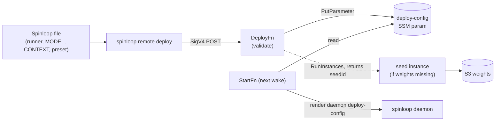
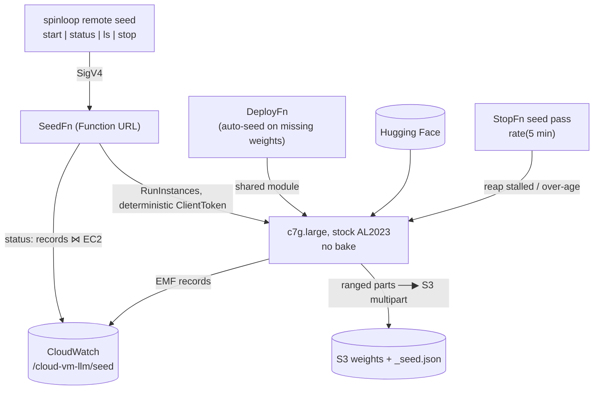
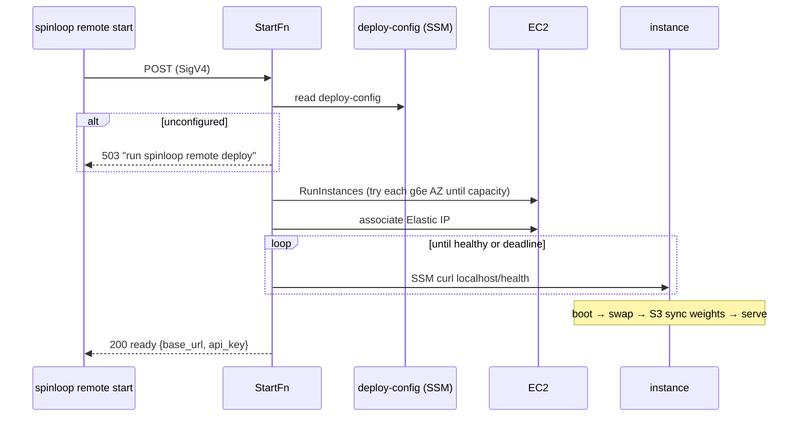
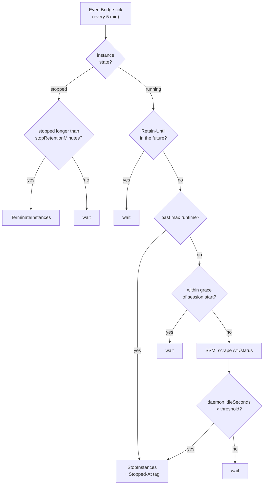

# Architecture

Maintainer-facing notes on how this deployment is put together. For *using* it, see
the [README](../README.md); for the pound-and-pence, [costs.md](costs.md).

## What it is

A **scale-to-zero, self-hosted OpenAI-compatible LLM endpoint** on AWS. A GPU
instance exists only while you are actually serving requests: a start Lambda
launches one on demand (or re-wakes one the sweep has stopped), and a stop
Lambda stops it after idle, then terminates it after a retention period.
Nothing runs (and almost nothing is billed) at rest.

Three ideas hold it together:

- **The instance is stateless.** No fixed EC2 instance; the weights live in S3
  and are synced onto the instance at boot. The start Lambda launches one from a
  baked AMI, or **re-wakes** a stopped one (its boot disk and synced weights
  survive a stop, so a re-wake skips the launch and the sync) — and the stop
  Lambda stops idle ones before terminating them past retention.
- **The runner is pluggable.** The inference server (currently vLLM; llama.cpp
  landing) is chosen per deployment, not hard-wired. A runner-neutral
  *deploy-config* says what to serve; the start Lambda builds the right command.
- **Deployment config is data, not a redeploy.** What to serve (runner, model,
  context, serve args) lives in an SSM parameter written by a deploy Lambda, so
  switching model or runner is a parameter write — no `cdk deploy`.

## The pieces

```mermaid
flowchart TB
  subgraph client["Your machine"]
    agent["coding agent<br/>(OpenAI client)"]
    spinloop["spinloop CLI"]
  end

  subgraph image["Image stack (cloud-vm-llm-image)"]
    pipeline["EC2 Image Builder<br/>pipeline (per runner)"]
    ami["slim AMI(s)<br/>tagged by role + runner"]
    pipeline -->|pnpm bake| ami
  end

  subgraph runtime["Runtime stack (cloud-vm-llm)"]
    start["StartFn"]
    stop["StopFn"]
    deploy["DeployFn"]
    dcfg[("SSM: deploy-config")]
    eip["Elastic IP"]
    s3[("S3: weights")]
    sg["Security group<br/>:port from your /32"]
    sched["EventBridge<br/>rate(5 min)"]
  end

  inst["EC2 g6e (L40S)<br/>runner + weights"]

  spinloop -->|SigV4 start, status| start
  spinloop -->|SigV4 stop / pause| stop
  spinloop -->|SigV4 deploy| deploy
  deploy -->|write| dcfg
  start -->|read at wake| dcfg
  start -->|RunInstances<br/>+ associate| eip
   start -.->|launch newest AMI by tag| ami
   inst -->|sync at boot| s3
   eip --- inst
   agent -->|http + api key| inst
   sched --> stop
   stop -->|SSM status scrape;<br/>stop, then terminate| inst
   start -->|StartInstances (re-wake)| inst
   start -->|SSM health| inst
```

The Lambdas live **outside the VPC** (no NAT cost) and reach the instance over
**SSM Run Command** — a `curl` to the on-instance **spinloop daemon**'s
loopback control API (`127.0.0.1:4242`), which supervises the engine and
collects its metrics — so nothing is exposed beyond the vLLM port, and that
only to your `/32`. A stable **Elastic IP** is re-associated on each launch so
the base URL never changes.

## The deploy-config control plane

The seam between "what infra exists" (CDK's job, provisioned once) and "what to
serve" (per deployment). `spinloop remote deploy` reads a Spinloop file and POSTs a
DeployConfig to the deploy Lambda; the Lambda validates it and writes the
`/cloud-vm-llm/deploy-config` SSM parameter. The next wake reads it.



The DeployConfig contract (`lambda/shared/deploy-config.ts`):

```
{ runner: "vllm" | "llamacpp",   // required; no default
  modelId, quant, contextSize, servedModelName,
  serveArgs: string[] }          // runner-specific flags, pre-tokenised
```

`weightsPrefix` is **not** part of the wire contract — the Lambda derives it as
`models/<runner>/<modelId>[/<quant>]/` and stores it in the parameter, so callers
never encode the S3 layout (and a prefix sent in the body is ignored). If those
weights are not in the bucket, the Lambda launches a seed itself and replies
`{seeding: true, seedId}`; a wake before it finishes would sync an incomplete
prefix, so wait for it. The id is stable (derived from the weights), unlike the
instance it replaced, so it is what `spinloop remote seed status` takes.

## Seeding

A seed is a supervised job, not a fire-and-forget script.



The pieces that matter:

- **Identity is derived, not supplied.** `seedIdFor(runner, modelId, quant)` is a
  slug of the same inputs that determine the weights prefix
  (`vllm--Qwen-Qwen3-32B`), so the same model always converges on the same seed
  and different models get their own.
- **Convergence is EC2's.** `RunInstances` deduplicates a repeated `ClientToken`
  within 24 hours, so two simultaneous starts collapse to one instance with no
  lock. The same window would also swallow a legitimate later retry, so the
  launch path checks the state of whatever instance comes back and escapes a
  dead one with a fresh generation.
- **Transfer is streaming with a floor.** 64 MiB ranged `GET`s feed an S3
  multipart upload, eight in flight; a failed part is retried alone. A part that
  exhausts its retries drops that one file to disk staging, so no model needs
  disk proportional to its size and streaming can never wedge.
- **Status is a join.** Records say what the seed managed to report; EC2 says
  whether it still exists. A gone instance whose last record was mid-transfer is
  `failed`, never "41% for ever".
- **Three termination layers**: the seeder's exit handling, `shutdown -h +60`
  armed as the boot script's first command, and the sweep's seed pass — which
  judges liveness from `DescribeLogStreams`'s `lastEventTimestamp`, *not* the
  daemon scrape used for inference instances (a seed runs no daemon).

At boot, `buildInferenceUserData()` renders it into the on-instance spinloop
daemon's own deploy config — the model as the synced local path, the bind
address and per-runner key delivery resolved into the serve args — and the
daemon builds the engine command from there (`vllm serve …` or
`llama-server …`). There is **no default runner**: an unset or invalid config
fails the wake loudly rather than guessing.

The parameter is **spinloop/manual-owned**. CDK creates it with a constant
`unconfigured` placeholder — deliberately *not* the cfg-derived config — so a
later `cdk deploy` can never clobber what `spinloop remote deploy` (or a manual
edit) put there. `pnpm run deploy`'s seed step (`scripts/seed-deploy-config.mjs`)
writes a cfg-derived initial config over the placeholder *only* while it is still
unconfigured, and only when CDK knows the full serve config (vLLM); llama.cpp's
serve args come from a Spinloop, so its config is left for `spinloop remote deploy`
to set.

## Wake lifecycle

`spinloop remote start` (or any POST to the start Function URL) blocks until the
server is answering, so the caller gets one "ready" with the base URL + key.



Boot user-data (built by the start Lambda from the deploy-config): log
`nvidia-smi`, add a swapfile, `aws s3 sync` the weights, fetch the API key, then
write the daemon's deploy config, start `spinloop daemon` (loopback `:4242`), and
request the engine's first start over its control API. The health check hits
`/health` on the port — portable across runners.

## Idle / stop

Engine activity is judged **on the instance**, not here. The daemon samples its
engine's counters every 15 seconds and reports `idleSeconds` on `/v1/status`;
the Lambda reads that number and applies the policy only it knows — retention,
the hard cap, the grace period.

The shutdown is **tiered**: an idle running instance is *stopped* (its boot
disk and the weights synced onto it survive, so a start re-wakes it in seconds
rather than re-launching from the AMI), and a stopped instance is *terminated*
once it has slept longer than `stopRetentionMinutes` — no volume is billed
forever. The stop Lambda marks its own stops with a `Stopped-At` instance tag
(EC2 has no stop time to read), and the start Lambda records a `Started-At`
tag on each re-wake so the max-runtime cap and grace period measure the current
session, not first boot.



That split is what fixed the sampling blip: one scrape every five minutes could
land in a lull between requests and read a busy endpoint as idle, whereas the
daemon has taken ~60 readings in that window. It also means the control plane
keeps no activity history — there is no `idle-state` parameter and no wake
timestamp, because the daemon counts an engine start as activity itself.

A daemon that cannot be reached, or that answers without a last-active time,
counts as "no activity", so a wedged box is still stopped at the threshold
rather than burning GPU-hours. There is deliberately **no fallback** to reading
counters: an instance whose daemon predates this behaviour (booted before it
shipped and never re-woken) reports no last-active time and is treated as
idle. Boot installs the daemon — the deploy config's pin, or the latest
release — so a fresh boot always reports it. A stopped instance with no
`Stopped-At` tag
(stopped outside the control plane, or a crash between the stop and its tag) is
self-healed: the next sweep records the stop time and gives it the full
retention. A `Retain-Until` instance tag (UTC ISO-8601) overrides both the idle
timer and the max-runtime cap (and, on a stopped instance, its termination);
`spinloop remote pause` stops an instance on purpose, and a manual
`spinloop remote stop` still terminates it immediately.

## Image stack

`cloud-vm-llm-image` defines an **Image Builder pipeline**, not an image — so
`cdk deploy` is instant and a bad bake can never fail the stack. `pnpm bake`
triggers a build out-of-band; each successful bake tags its AMI (role, and — as
the second runner lands — runner), and the start Lambda launches the **newest
AMI matching the tags**. A slim AMI carries only the driver + the runner
(vLLM as a `uv` venv; llama.cpp as a prebuilt CUDA `llama-server`) — no
Docker, and no spinloop: each instance's boot installs the daemon (the deploy
config's pin, or the latest release), so the AMI never carries a release of it.

## Key files

| Concern | File |
|---|---|
| Config + validation | `lib/config.ts` |
| Runtime stack (lambdas, EIP, S3, params) | `lib/llm-stack.ts` |
| Image Builder pipeline | `lib/image-stack.ts` |
| Deploy-config contract | `lambda/shared/deploy-config.ts` |
| Runner registry (one spec per runner: boot, file selection) | `lambda/runners/` |
| The on-instance daemon's API (SSM curl targets, status + metrics types) | `lambda/shared/daemon.ts` |
| Wake / launch / user-data (`buildInferenceUserData`) | `lambda/start/index.ts` |
| Idle / manual stop | `lambda/stop/index.ts`, `lambda/shared/idle.ts` |
| Set the deploy-config | `lambda/deploy/index.ts` |
| Shared AWS + SSM helpers | `lambda/shared/aws.ts` |
| Seed control surface (start/status/list/stop) | `lambda/seed/index.ts` |
| Seed contract shared with the seeder (job, records, manifest) | `lambda/shared/seed/contract.ts` |
| Seed identity + idempotency token | `lambda/shared/seed/identity.ts` |
| Seed launch + boot script | `lambda/shared/seed/launch.ts` |
| Seed state (records ⋈ instance) | `lambda/shared/seed/status.ts` |
| Seed reaping decision (layer three) | `lambda/shared/seed/reap.ts` |
| The seeder itself (runs on the instance) | `seeder/src/` |
| Whether weights are already seeded (deploy's pre-check) | `lambda/shared/seed.ts` |
| Seed the initial deploy-config (once, over the placeholder) | `scripts/seed-deploy-config.mjs` |
